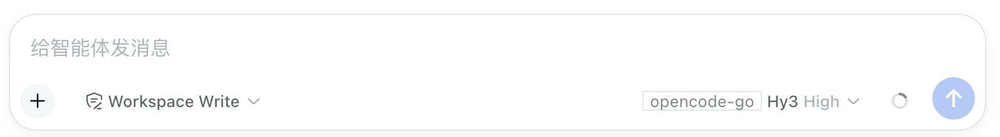
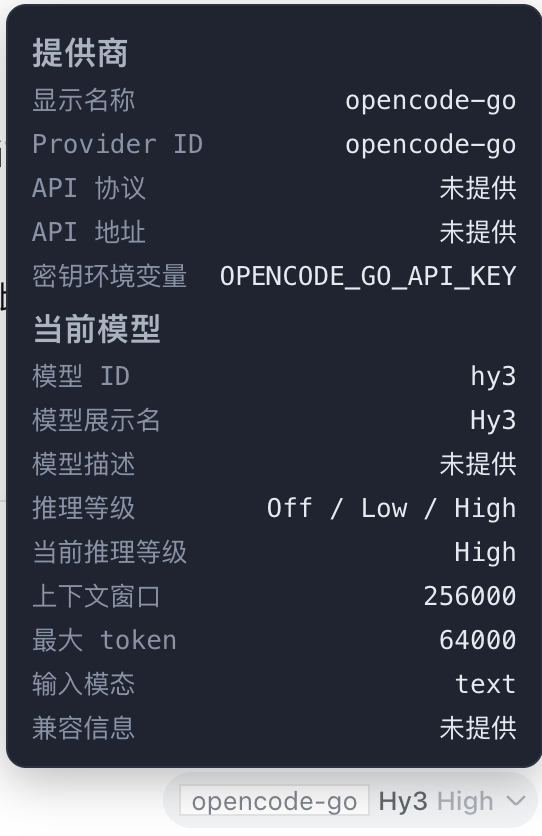

# dsh-provider-info

A [DeepSeek Harness](https://github.com/deepseek-ai/DeepSeek-Harness) plugin.

> [中文说明](README.zh.md)

It does exactly one thing: **next to where you pick a model, it shows a small line of text saying which provider (company) is serving the currently selected model.**

Move your mouse over that text and a small dark panel pops up with full details about the provider and the current model.

## The problem it solves

DeepSeek Harness can be configured with several AI providers at once, and each provider has many models underneath. Just looking at a model name, it's hard to tell whose API it actually goes through. This plugin shows you at a glance: **which provider is serving the model I'm using right now.**

## What it does

- **Adds a small label next to the model selector** showing the provider's display name for the current model. If the provider has no display name, it falls back to the provider's ID.
- **Hover the label to open a small panel** with two sections:
  - **Provider info**: display name, provider ID, API protocol (e.g. OpenAI-compatible, Anthropic, etc.), API base URL, and the environment variable name for the API key.
  - **Current model info**: model ID, display name, description, available reasoning efforts, the current reasoning effort, context window, max tokens, supported input modalities, and compat info.
- Missing values are shown as `未提供`; long values wrap.
- The label updates automatically as you switch models.
- **Never touches your keys**: it only shows the *environment variable name* for the credential — it never reads or shows the actual secret.
- **Quota / balance section**: for providers that support it, the hover panel also shows the provider's remaining quota — DeepSeek account balance, or OpenCode Go's 5-hour / weekly / monthly usage limits with reset countdowns. Recognized-but-unsupported providers show `暂不支持该供应商查询`; missing keys or query failures show `未配置 API Key` / `查询失败`.
  - DeepSeek: `GET /user/balance` (read-only, never charges you nor burns tokens).
  - OpenCode Go: `GET /v1/usage` (read-only usage windows).
  - The host caches the result per provider for 5 minutes, so hovering repeatedly doesn't hammer the provider API.
  - The quota block has a **Refresh** button: click it to bypass the cache and immediately pull the latest quota (still read-only). Hovering normally uses the 5-minute cache.
  - While your mouse is over the panel/button, message-stream scrolling won't hide the panel, so you can read it comfortably; it only hides on scroll after you move away.
  - **Refresh behavior** is adjustable from **Settings → 提供商余量**: enable *mouse-hover immediate refresh* (default on) to bypass the cache on every hover, or enable *auto-refresh* (default off) with an interval in minutes (default 5, minimum 1) to re-query while the panel is open. Settings persist in `$DSH_HOME/dsh-provider-info.json` (mode 0600).

## Screenshots

The small label next to the model selector (here showing the provider `opencode-go`):



The detail panel that appears when you hover over it:



## Installation

This plugin is loaded through the DSH profile mechanism (for example the `web` profile).

### Option 1: Install via command

```bash
dsh plugin --profile web add dsh-provider-info
```

### Option 2: Configure manually

Add it to your profile's dependencies:

```json
// profile package.json
"dependencies": { "dsh-provider-info": "^0.1.0" }
```

Then declare the bundle in your profile config:

```yaml
# profile config
dsh:
  profile:
    bundles:
      - dsh-provider-info
```

After installing, restart `dsh web` once and refresh the page.

## Settings

Open **设置 → 提供商余量** to configure the quota refresh behavior:

- **鼠标悬停立即刷新** (default checked): re-query the remaining quota immediately whenever you hover the badge, bypassing the 5-minute cache.
- **自动刷新** (default unchecked) + **自动刷新间隔(分钟)** (default 5, minimum 1): while the hover panel is open, re-query the remaining quota on the configured interval.

Changes are saved to `$DSH_HOME/dsh-provider-info.json` and apply immediately.


## Usage

There's nothing to do. Open the chat interface and the small label appears next to the model selector automatically. Hover over it to see the details.

## Privacy

This plugin only reads provider configuration from the running DSH instance on your machine to display it. All data is shown in your own browser and **is never sent anywhere**. The API key value is never read or displayed — only its environment variable name.

## License

[MIT](LICENSE)
